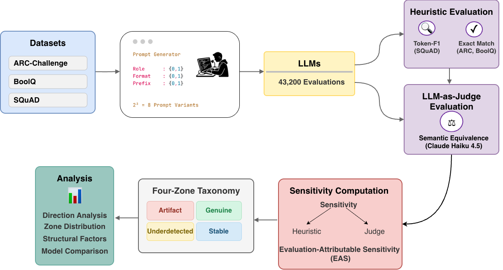
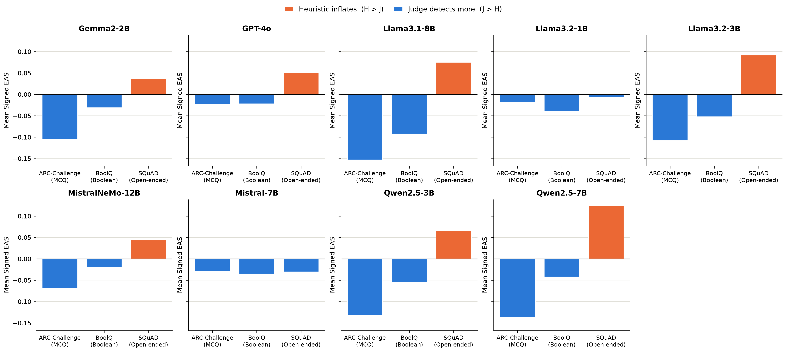
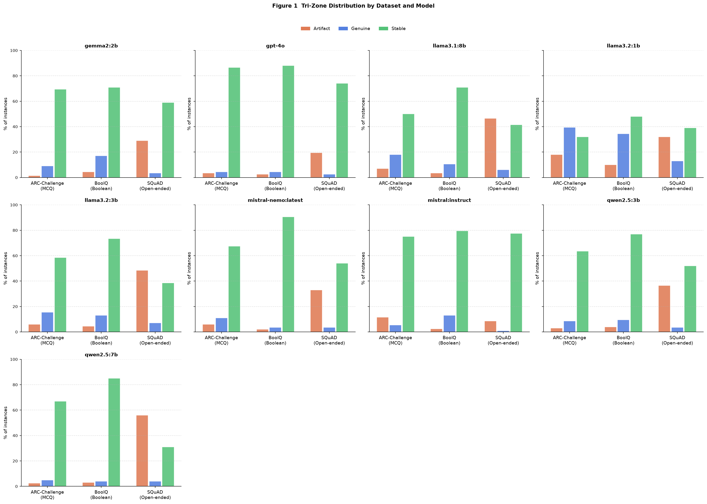
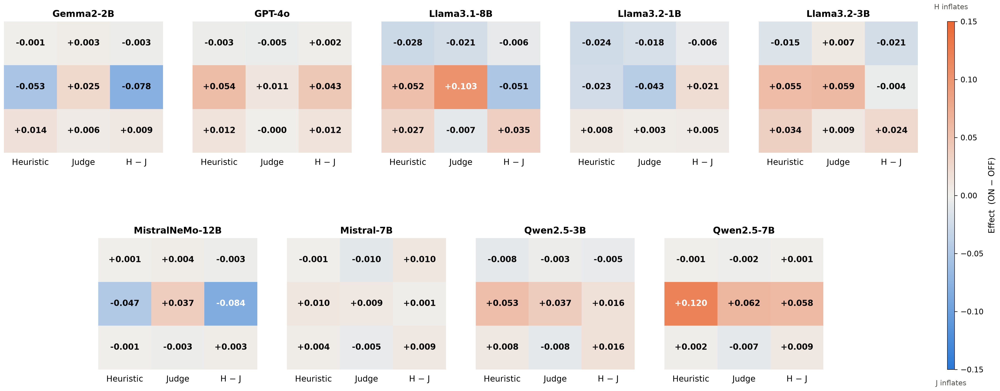

# Prompt Sensitivity or Evaluation Artifact?

### A Task-Aware Analysis for Large Language Models

[](paper/Prompt_Sensitivity_or_Evaluation_Artifact.pdf)


This repository contains the official implementation and experimental artifacts for **“Prompt Sensitivity or Evaluation Artifact? A Task-Aware Analysis for Large Language Models.”**

Prompt sensitivity is commonly interpreted as an intrinsic robustness weakness of large language models. This work asks a different question: **how much of the measured sensitivity is caused by the model, and how much is introduced by the evaluation method?**

We introduce **Evaluation-Attributable Sensitivity (EAS)** and **Signed EAS**, instance-level diagnostics that compare sensitivity measured using task-specific heuristic metrics with sensitivity measured by a semantic LLM judge.

> [!IMPORTANT]
> The current implementation, final analysis code, and updated outputs are located in [`study/`](study/). Other top-level folders are retained as earlier experimental artifacts.

## Method overview

<p align="center">
  
</p>

Each benchmark item is evaluated under a controlled \(2^3\) factorial prompt design with three binary structural factors:

- **Role framing:** absent or present
- **Format directive:** absent or present
- **Answer prefix:** absent or present

This produces **8 prompt variants per item**. Model responses are scored using both a task-specific heuristic and a held-out LLM judge. Their disagreement is then analysed through EAS, Signed EAS, a four-zone taxonomy, and structural-factor effects.

## Main contributions

1. **Evaluation-Attributable Sensitivity (EAS)**  
   Quantifies the magnitude of disagreement between heuristic-based and judge-based prompt-sensitivity estimates.

2. **Signed EAS**  
   Identifies the direction of disagreement:
   - positive: the heuristic reports more sensitivity;
   - negative: the judge detects more sensitivity.

3. **Four-zone diagnostic taxonomy**  
   Classifies each instance as **Artifact**, **Underdetected**, **Genuine**, or **Stable**.

4. **Cross-family evaluation**  
   Evaluates 9 instruction-tuned models from 5 model families on 3 task formats.

## Experimental design

| Component                        | Configuration                                         |
| -------------------------------- | ----------------------------------------------------- |
| Datasets                         | ARC-Challenge, BoolQ, SQuAD                           |
| Items                            | 200 per dataset                                       |
| Prompt variants                  | 8 per item                                            |
| Prompt factors                   | Role, format, answer prefix                           |
| Evaluated models                 | 9 models from Llama, Qwen, Mistral, Gemma, and OpenAI |
| Decoding                         | Greedy decoding, temperature 0, 64-token budget       |
| Semantic judge                   | Held-out Claude Haiku 4.5                             |
| Total response-judge evaluations | 43,200                                                |
| Confidence intervals             | 1,000 bootstrap resamples                             |

### Evaluated models

- Gemma2-2B
- GPT-4o
- Llama-3.1-8B-Instruct
- Llama-3.2-1B-Instruct
- Llama-3.2-3B-Instruct
- Mistral-7B-Instruct
- Mistral-NeMo-12B-Instruct
- Qwen2.5-3B-Instruct
- Qwen2.5-7B-Instruct

## Metrics

For an item \(i\), let the heuristic and judge scores across the eight prompt templates be \(h*{i,t}\) and \(j*{i,t}\).

\[
\mathrm{SensH}_i = \sigma_t(h_{i,t})
\]

\[
\mathrm{SensJ}_i = \sigma_t(j_{i,t})
\]

\[
\mathrm{EAS}\_i = \left|\mathrm{SensH}\_i-\mathrm{SensJ}\_i\right|
\]

\[
\mathrm{SignedEAS}\_i = \mathrm{SensH}\_i-\mathrm{SensJ}\_i
\]

The heuristic evaluation is task-aware:

- **ARC-Challenge:** option-letter extraction and exact match
- **BoolQ:** yes/no extraction and exact match
- **SQuAD:** maximum token-F1 over the reference answers

The semantic evaluation uses a held-out LLM judge that returns a binary correctness verdict.

## Key findings

- The **direction of Signed EAS is associated more strongly with task format than with model family or parameter scale**.
- On **ARC-Challenge and BoolQ**, Signed EAS is generally negative: the semantic judge detects sensitivity that rigid extraction heuristics can miss.
- On **SQuAD**, Signed EAS is generally positive: token-F1 can treat semantically correct paraphrases as inconsistent responses.
- **BoolQ is the most stable task overall**, consistent with the reliability of yes/no extraction.
- The **format directive is the dominant structural prompt factor**, although its effect varies across model families.
- Role framing has comparatively small effects.

<p align="center">
  
</p>

## Four-zone taxonomy

The current implementation uses the 75th-percentile thresholds of `SensH` and `SensJ` to separate low- and high-sensitivity instances.

| Zone              | Heuristic sensitivity | Judge sensitivity | Interpretation                                            |
| ----------------- | --------------------: | ----------------: | --------------------------------------------------------- |
| **Stable**        |                   Low |               Low | Both evaluations indicate stable behaviour                |
| **Artifact**      |                  High |               Low | The heuristic introduces or inflates apparent sensitivity |
| **Underdetected** |                   Low |              High | The heuristic misses sensitivity detected semantically    |
| **Genuine**       |                  High |              High | Both evaluations indicate real prompt sensitivity         |

<p align="center">
  
</p>

## Structural-factor analysis

For each prompt factor \(k\), the code computes its main effect as the difference between the mean score when that factor is enabled and disabled:

\[
\Delta_k^e =
\mathbb{E}[e \mid k=1]-
\mathbb{E}[e \mid k=0]
\]

where \(e\) is either the heuristic or judge score. Comparing \(\Delta_k^h\) and \(\Delta_k^j\) distinguishes semantic improvements from changes that merely make answers easier for a heuristic to parse.

<p align="center">
  
</p>

## Repository structure

```text
.
├── README.md
├── requirements.txt
├── figures/
│   └── eas_workflow.png
└── study/
    ├── templates.py        # 2^3 structural prompt design
    ├── prepare.py          # Load datasets and create prompts.jsonl
    ├── infer.py            # Ollama, Hugging Face, OpenAI, and Anthropic inference
    ├── judge.py            # Held-out LLM-as-Judge evaluation
    ├── metrics.py          # SensH, SensJ, EAS, Signed EAS, zones, and factor effects
    ├── plot.py             # Publication-quality result figures
    ├── run.sh              # Convenience script for a single model
    ├── run_all.sh          # Lightweight multi-model example
    └── output/
        ├── <model>/        # Per-model responses, judgements, and metrics
        └── combined_final/
            ├── metrics_instance.csv
            ├── metrics_dataset.csv
            └── figures/
```

## Quick start

### 1. Clone the repository

```bash
git clone https://github.com/sayumimuthu/llm-prompt-sensitivity-evaluation-artifact.git
cd llm-prompt-sensitivity-evaluation-artifact
```

### 2. Create an environment

```bash
python -m venv .venv
source .venv/bin/activate
python -m pip install --upgrade pip
pip install -r requirements.txt
```

Install the packages required by the inference backend you plan to use:

```bash
# Hugging Face local models
pip install torch transformers accelerate

# OpenAI API
pip install openai

# Anthropic API
pip install anthropic
```

### 3. Configure credentials

`study/infer.py` and `study/judge.py` read environment variables from `study/.env` or `att1/.env`.

```bash
# Add only the variables required by your selected backends.
HF_TOKEN=your_huggingface_token
OPENAI_API_KEY=your_openai_api_key
ANTHROPIC_API_KEY=your_anthropic_api_key
OLLAMA_BASE_URL=http://localhost:11434
```

Do not commit `.env` files or API keys.

## Reproducing the pipeline

### Step 1: Prepare the benchmark prompts

```bash
python study/prepare.py \
  --n 200 \
  --seed 42 \
  --out-dir study/output
```

This creates `study/output/prompts.jsonl` with:

\[
200\ \text{items} \times 3\ \text{datasets} \times 8\ \text{templates}
= 4,800\ \text{prompts}.
\]

### Step 2: Run model inference

Example using Ollama:

```bash
python study/infer.py \
  --in-file study/output/prompts.jsonl \
  --out-file study/output/llama3.1-8b/responses.jsonl \
  --backend ollama \
  --model llama3.1:8b \
  --temperature 0 \
  --max-tokens 64
```

Other supported backends are `hf_local`, `openai`, and `anthropic`.

### Step 3: Run a held-out LLM judge

```bash
python study/judge.py \
  --in-file study/output/llama3.1-8b/responses.jsonl \
  --out-file study/output/llama3.1-8b/judged.jsonl \
  --judge-backend anthropic \
  --judge-model claude-haiku-4-5
```

> The published experiment uses a held-out judge to avoid self-evaluation bias.

### Step 4: Compute the metrics

For one model:

```bash
python study/metrics.py \
  --in-files study/output/llama3.1-8b/judged.jsonl \
  --out-instance study/output/llama3.1-8b/metrics_instance.csv \
  --out-dataset study/output/llama3.1-8b/metrics_dataset.csv
```

For a combined analysis, provide all judged files after `--in-files`.

### Step 5: Generate the figures

```bash
python study/plot.py \
  --in-instance study/output/combined_final/metrics_instance.csv \
  --in-dataset study/output/combined_final/metrics_dataset.csv \
  --out-dir study/output/combined_final/figures
```

The script generates:

- `fig1_trizone.png`
- `fig2_scatter.png`
- `fig3_ablation.png`
- `fig4_eas_by_task.png`
- `fig5_eas_ci.png`
- `fig6_signed_eas.png`

## Using the precomputed results

The final aggregate outputs used for the repository visualisations are available in:

```text
study/output/combined_final/
```

- [`metrics_instance.csv`](study/output/combined_final/metrics_instance.csv) contains one row per item-model pair.
- [`metrics_dataset.csv`](study/output/combined_final/metrics_dataset.csv) contains dataset-level aggregates and bootstrap confidence intervals.
- [`figures/`](study/output/combined_final/figures/) contains the generated result plots.

The individual model directories contain the corresponding raw responses, judge verdicts, and intermediate outputs.

```

## Authors

- **Sayumi Muthukumarana**
- **Buddhi Wijenayake**
- **Roshan Godaliyadda**
- **Parakrama Ekanayake**

University of Peradeniya, Sri Lanka.

## Acknowledgement

This research was funded by the University Research Council (URC), University of Peradeniya, under Grant No. 32.
```
